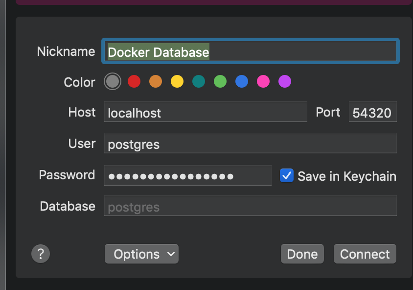

### Writing Data to a Postgres Database using Docker

This example goes over how to create a docker container on your local computer using docker. The notebook within this directory goes over how to connect the docker container on your machine and how to read and write data to the database using pandas and sql alchemy.

### Starting a local docker container

After you install docker on your local laptop. Run the following command to install a postgres docker container on you local computer:.

```bash
# Run a postgres docker container using a public image
docker run -d --name my_postgres -v my_dbdata:/var/lib/postgresql/data -p 54320:5432 postgres:11
```

### View Database Logs

When your container is up and running. View the logs of the docker container using the following command.

```bash
# View container logs
docker logs -f my_postgres
```

### Connecting to the Database

You can connect to the database using this command line using the following docker command in your terminal session.

```bash
# Connect to the database via bash
docker exec -it my_postgres psql -U postgres

```

Once we are connected to the container. Now we can run SQL commands in terminal session against our postgres database.

```sql
-- View the current databases
\d

-- Check the current version of Postgres
SHOW server_version;


-- Disconnect from Postgres server
\q
```

### Connecting to Database via Postico

Now that the database is running within a docker container. We can now connect to this database using a third-party software if needed.




## Creating Conda Enviroment

We can also connect to the database using python. Create a conda virtual environment using the following command with the following requirements. Next, install jupyter notebooks. Open up the `19-09-06 Postgres Connector` and run the python code within the notebook. The code with notebook will go over how to write data into database and how to pull data from your database.

```
conda create -n postgres python=3.6 \
&& source activate postgresql \
&& pip install psycopg2-binary \
&& conda install -c anaconda sqlalchemy \
```


### References

https://www.saltycrane.com/blog/2019/01/how-run-postgresql-docker-mac-local-development/
